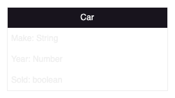
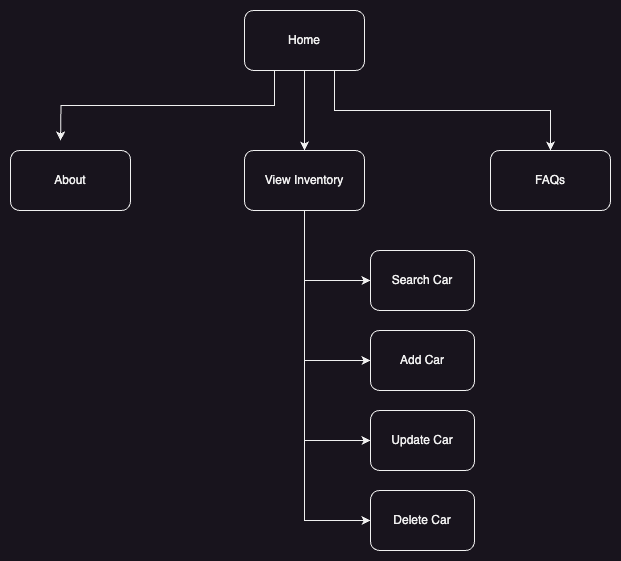
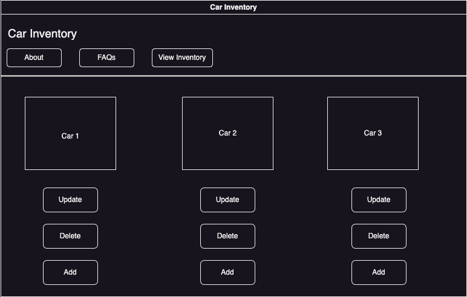
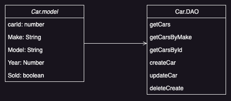

# Milestone1 
## Car Inventory App

Instructor Feedback: Include Images in Readme.md
## Introduction:
This application will make it simple to keep track of your car inventory. This web app will allow users to manage their vechile stock and enhance productivity.
## Functionality Requirements
- As a developer, I would like to store the car inventory in a database so that the user can easily retrieve and store cars.
- As a developer, I would like to have an easy-to-use web app so that users can easily perform actions.
- As a developer, I would like to have a create function, so that users can add inventory.
- As a developer, I would like to have a remove function, so that users can remove inventory.
- As a developer, I would like to have a update function, so that users can update inventory.

## Database Diagram

## Sitemap

## WireFrame

## UML Classes

## Risks
