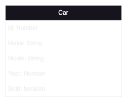
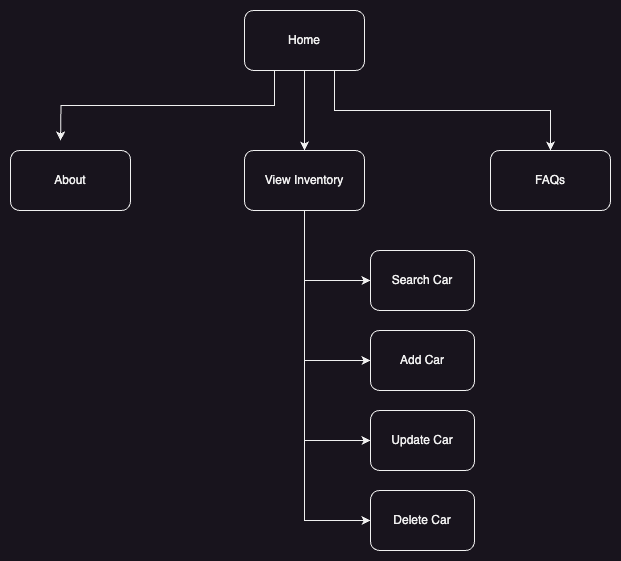
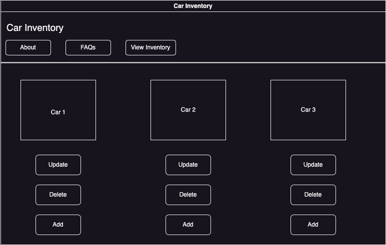

# Milestone - Car Inventory App

Screencast: www.example.com

## UPDATES
| Date | Updates |
| --- | ----------- |
| 07/08/23 | Updated UML & Database Diagrams |
| 07/08/23 | Added Rest API documentation |


## Introduction:
This application will make it simple to keep track of your car inventory. This web app will allow users to manage their vehicle stock and enhance productivity.
## Functionality Requirements
- As a developer, I would like to store the car inventory in a database so that the user can easily retrieve and store cars.
- As a developer, I would like to have an easy-to-use web app so that users can easily perform actions.
- As a developer, I would like to have a create function, so that users can add inventory.
- As a developer, I would like to have a remove function, so that users can remove inventory.
- As a developer, I would like to have a update function, so that users can update inventory.

## Database Diagram


## Sitemap


## WireFrame


## UML Classes


## Risks

## Rest API
The REST API to the Car app is described below.
### Get the list of Cars
 #### Request
    Get /cars/
### Get the list of Cars from Maker
 #### Request
    Get /cars/Make
### Get Car by Id
 #### Request
    Get /cars?carId=id
### Create Car
 #### Request
    Post /cars/
  #### Body
```json
 {
        "make": string,
        "model": string,
        "year": int,
        "sold": boolean
    }
```
### Update Car
 #### Request
    Put /cars/
  #### Body
```json
 {
        "carId":  carId,
        "make": string,
        "model": string,
        "year": int,
        "sold": boolean
    }
```
### Delete Car
 #### Request
    Delete /cars/id
