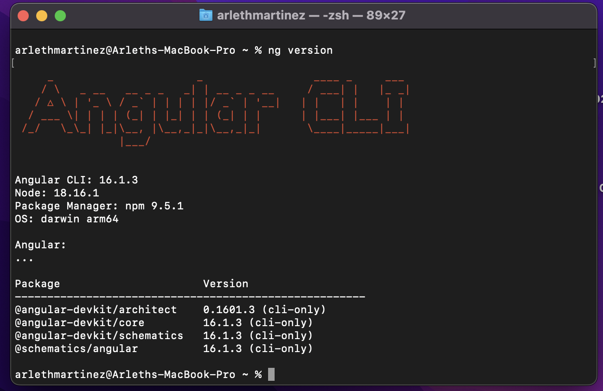
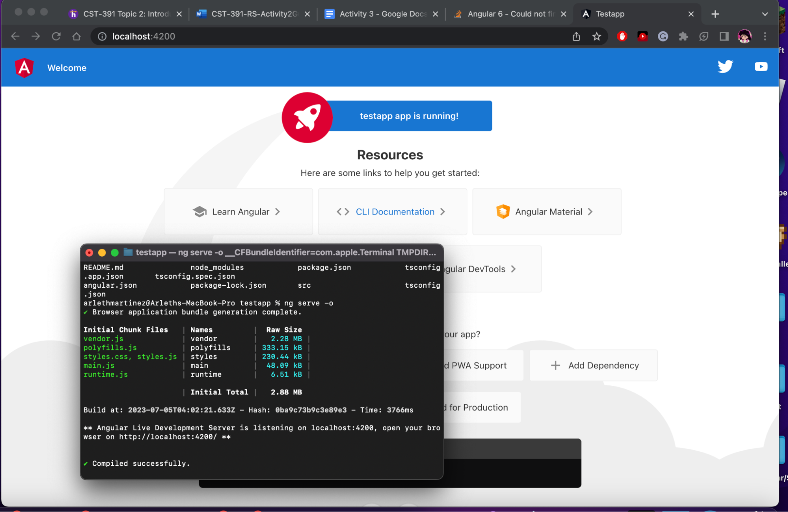
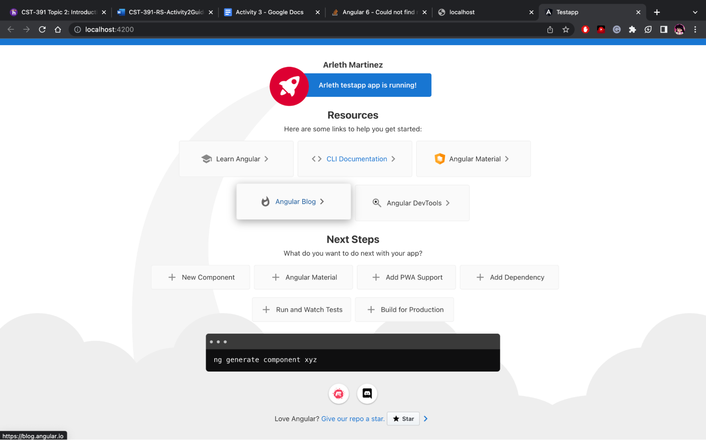

# Angular Tools & First App

## Screenshots

My Angular Version

Node server running.

Modified title variable in app.component.ts.

Added message variable in app.component.ts.

## Research Questions

### Project Structure Folders
  Node_modules - Provides npm packages to the entire workspace. Workspace-wide node_modules dependencies are visible to all projects.
  Src - Source files for the root-level application project go here.
  src/app - contains the project's logic and data. Angular components, templates, and styles go here.
  src/assets - Contains assets (web assets) this includes images, videos and JSON files to styles and scripts. 
  src/environments- This directory contains the base configuration file, environment.ts, which provides configuration for production, the default environment.
### Project Structure Files
  Angular.json - CLI configuration defaults for all projects in the workspace, including configuration options for the build, serve, and test tools that the CLI uses
  Package.json - Configures npm package dependencies that are available to all projects in the workspace.
  Tsconfig.json - The TypeScript configuration for projects in the workspace. All other configuration files inherit from this file.
### Angular Resultant Page
  Main.ts - The main entry point for the application. Compiles the application and bootstraps the application's root module (AppModule) to run in the browser.
  app.component.css- Defines the base CSS stylesheet for the root AppComponent.
  app.component.html- Defines the HTML template associated with the root AppComponent.
  app.component.ts- Defines the logic for the application's root component named AppComponent.
  app.module.ts- Defines the root module, named AppModule, that tells Angular how to assemble the application.

