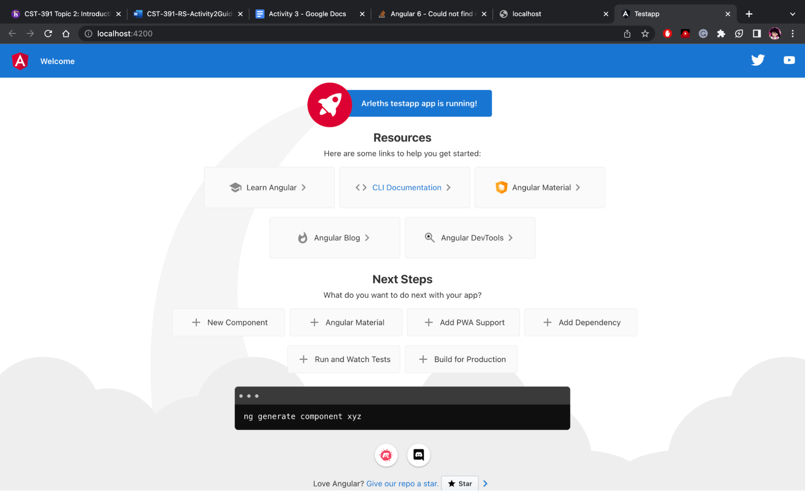

# Angular Tools & First App

## Screenshots

My Angular Version

Node server running.

Modified title variable in app.component.ts.

Added message variable in app.component.ts.

## Research Questions

### Project Structure Folders

### Project Structure Files

### Angular Resultant Page
