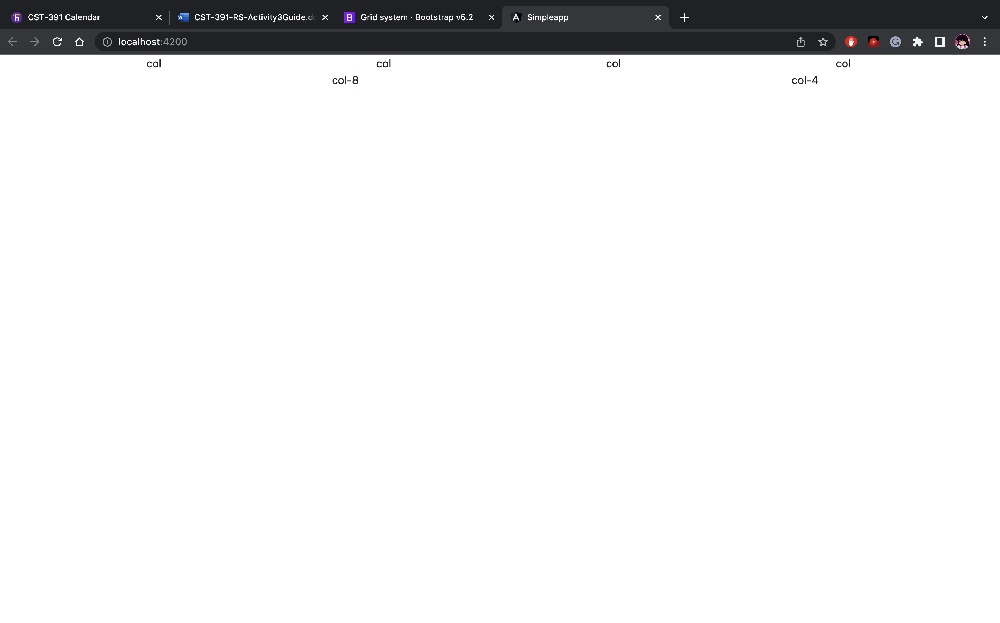

# Activity 3
## Part 1
### Screenshots

Demonstrating Responsive Grid with a large screen.

Demonstrating Responsive Grid with a small screen.

Default state of Shop Component (no name entered).

Shop Component with the name entered.

Browser Dev Tools display the Product and Quantity after clicking the buy button.
### Research Questions
 ##### @Input
@Input decorator is used to pass data from the parent component to the child component. In this case, we passed the name from the shop to the info component.
 ##### [value]
   In order to bind to an element's property, we enclose it in square brackets. This identifies the property as a target property. In this case, we used the [value] and assigned it the value of the selected drop-down.
  ##### [(ngModel)
  The ngmodel binds the value of HTML controls to app data. With the ng-model, you can bind the value of an input field to a variable created in Angular. The binding goes both ways. If the user changes the value inside the input field, the Angular property will also change its value. In this case, if the user changes the drop-down selection, the property product will also change.
## Part 2
### Screenshots

### Research Questions
