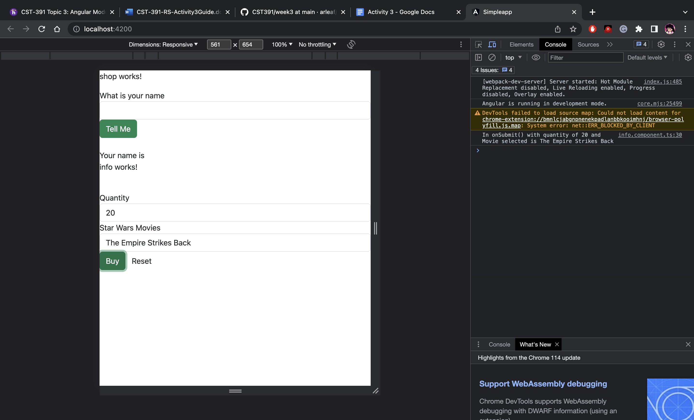

# Activity 3
## Part 1
### Screenshots

Demonstrating Responsive Grid with a large screen.

Demonstrating Responsive Grid with a small screen.

Default state of Shop Component (no name entered).

Shop Component with the name entered.

Browser Dev Tools display the Product and Quantity after clicking the buy button.
### Research Questions

## Part 2
### Screenshots

### Research Questions
