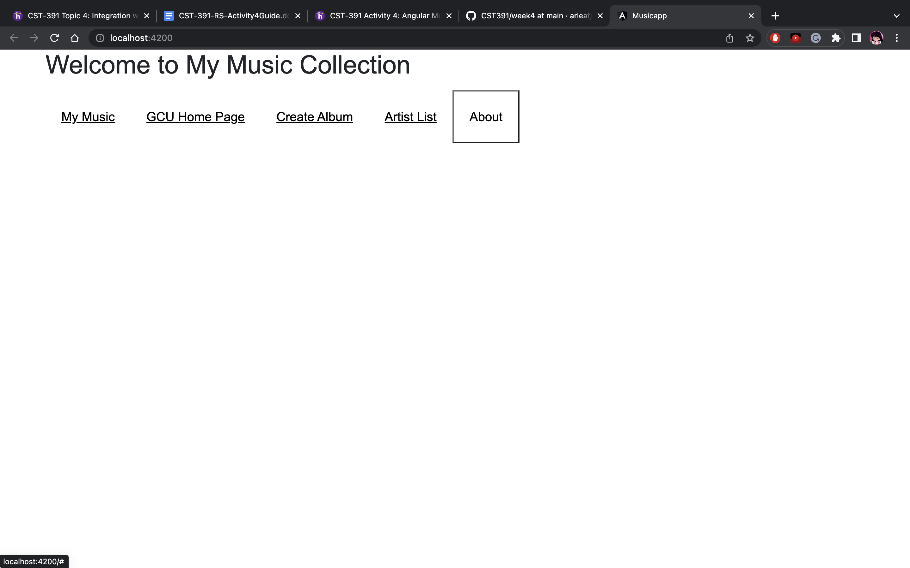
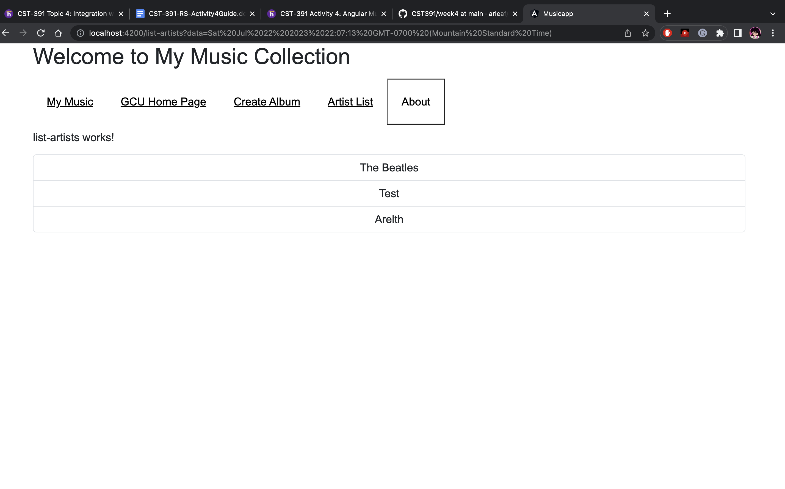
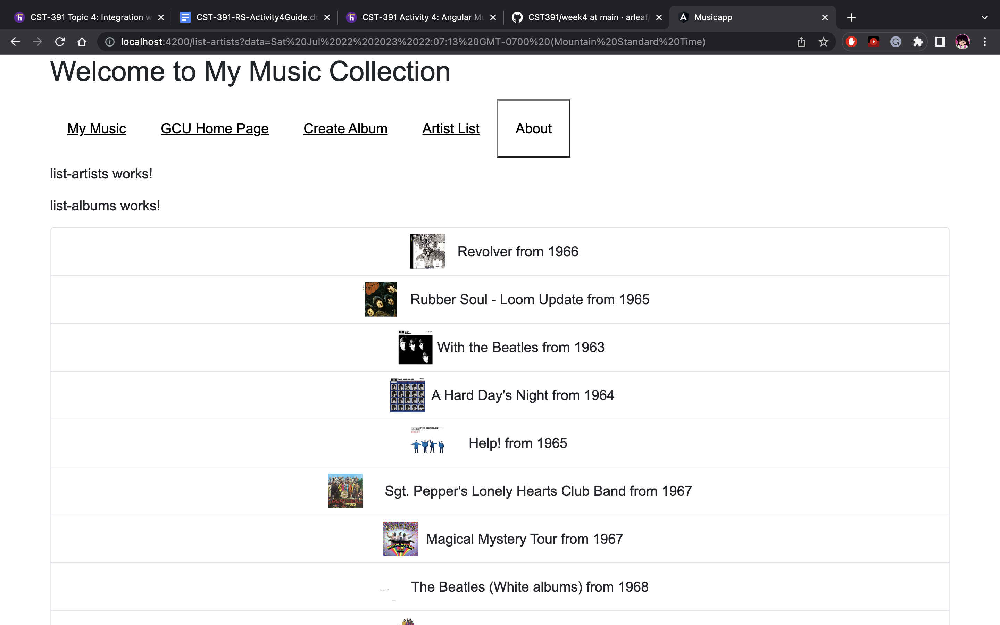
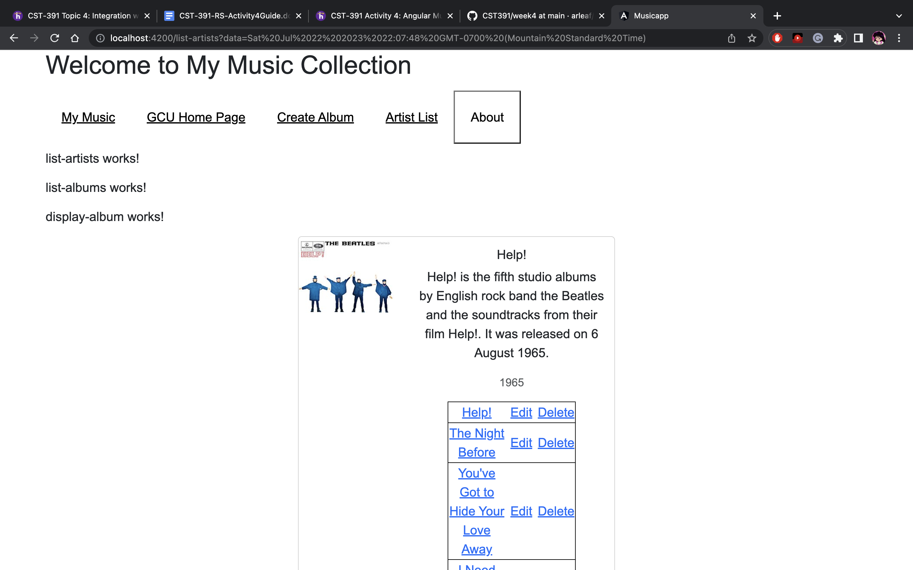
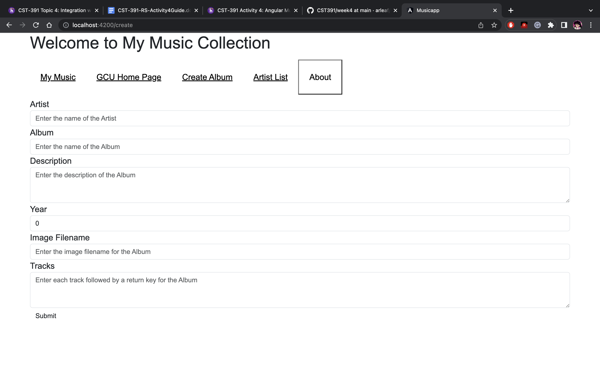

# Activity 4
### Screenshots

Main application Home Page.

Artists List Screen. 

List of Albums from selected Artist Screen.

Album List with Tracks included.

Create Album Screen.

### Research Questions
 ##### Angular logged in State
 The application state can be any action such as opening dropdown, form filling, navigating to the page, etc. Angular has a state machine called Angular Router which we have used in our activities. This communicates to our server via the URL. Sharing/storing the state of the application can be done by sharing/storing the URL. It even allows us to keep the state of the router as it keeps changing over time when users navigate from page to page.
