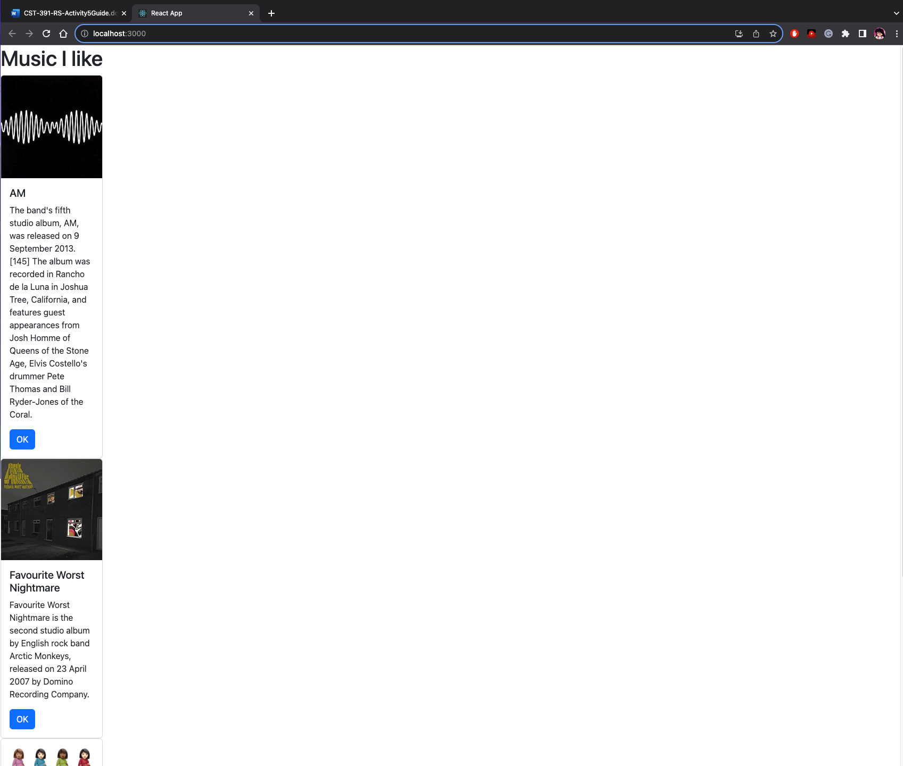

# Activity 5

##Part 1

### Custom Components Screenshot

Music React App. Shows a card view for each album

### Summary
In this Activity, we created our first React Application which displays Albums in a card view. We did this by removing the src files and modifying the index.js file. In the file, we used the Const App function which displays the JSX code( JS unique to React, looks like HTML) to the browser. In the JSX, it is important there is only one parent element else it will not work. In order to render the app on the webpage, we used the ReactDOMrender at the end of the file. We then added styling via Bootstrap. We also wanted to have multiple cards displaying multiple albums and to accomplish this, we created a custom card component. We then made use of the component properties which allow us to pass parameters for each card. Refactoring was then done to have the app code in the App.js file. This is a standard practice in React.
