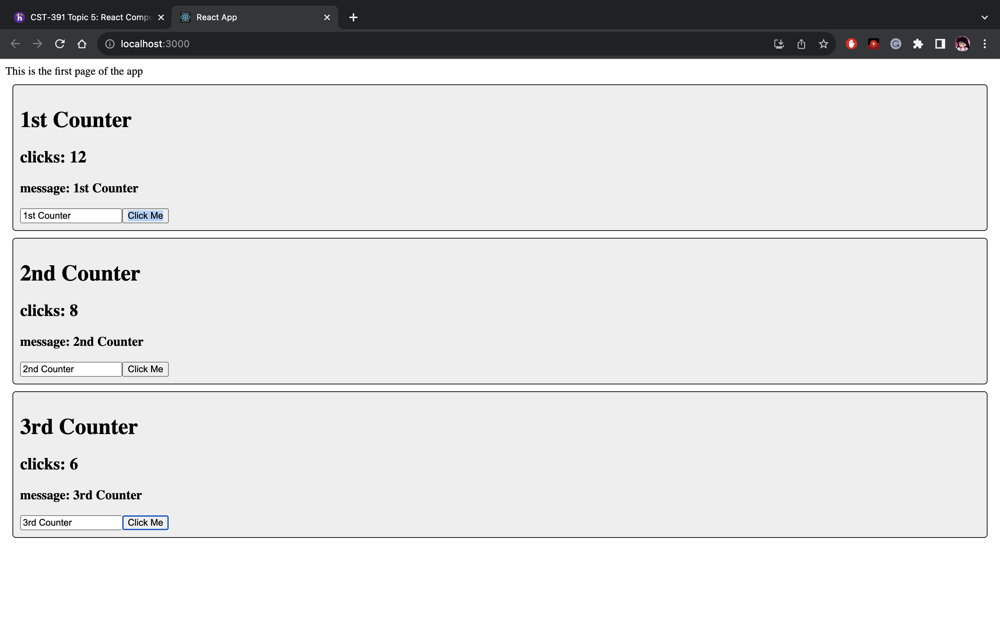
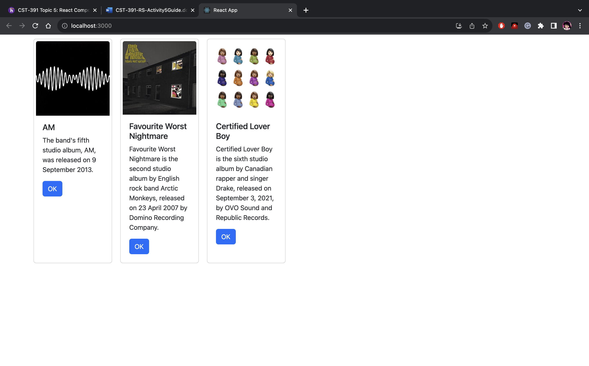

# Activity 5

## Part 1

### Custom Components Screenshot

Music React App. Shows a card view for each album

### Custom Components Summary
  In this Activity, we created our first React Application which displays Albums in a card view. We did this by removing the src files and modifying the index.js file. In the file, we used the Const App function which displays the JSX code( JS unique to React, looks like HTML) to the browser. In the JSX, it is important there is only one parent element else it will not work. In order to render the app on the webpage, we used the ReactDOMrender at the end of the file. We then added styling via Bootstrap. We also wanted to have multiple cards displaying multiple albums and to accomplish this, we created a custom card component. We then used the component properties, allowing us to pass parameters for each card. Refactoring was then done to have the app code in the App.js file. This is a standard practice in React.

### Statechanger Demo
### Screenshot

Statechanger Demo App. This shows the updated clicks for each counter.

## Part 2
### State & Props Screenshot

Music App after using state and properties. 

### Summary
  In this Activity, we modified our previous Music React App to use state and properties. Props are defined by the parent and can be used to affect the looks of a child. We used these properties in our rendered list function which generates the complete JSX list via a map. The app also has a state albumList and handler setAlbumList which we set by using a hook. The state is usually changed by user action and updates our UI. The handler handles clicks or changes but for now, we have left it undefined. 

