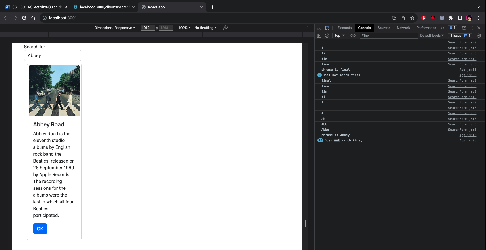
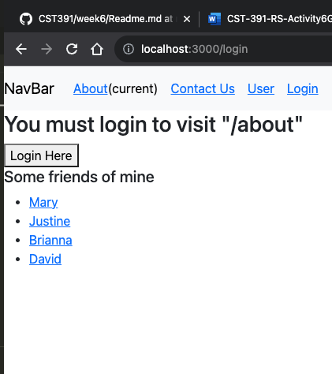
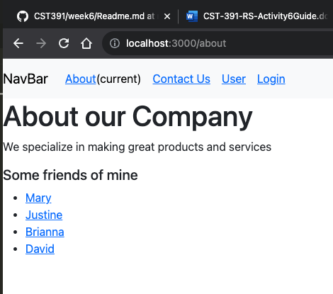

# Activity 6

## Part 3 - External Data Sources

### Stopping Point 3 - Screenshots

Music App connected to our MusicAPI and displays all albums.

Music App connected to our MusicAPI and displays all albums with matching search phrase 'Abbey'.

### External Data Sources Summary
  In this part of the activity, we transitioned from using an albums JSON, to using our MusicAPI to manage our album data. To do this we used a hook to set our initial album list and update it. We then used the useEffect function to set a new albumList state to update and render the list. We then added a new search functionality. This allows us to search our albums for a phrase.  To do this we added a searchForm component. We then used OnChage and onSubmit handlers to display the state of the component. We used callbacks to pass information from the SearchForm to the handler. We then used the Axios library to move from a JSON to fetching from our API.

## Routing App Demo - Screenshots
 
Routing App Demo without logging in. 
 
Routing App demo after login displays the page contents.
