# Activity 7

## Mini App 3 – Dynamic Components

### Screenshots
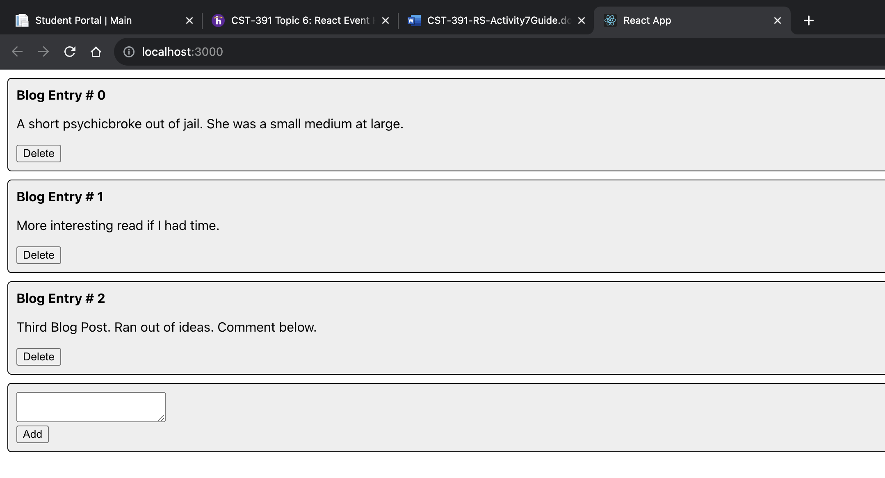
Blog App start page.

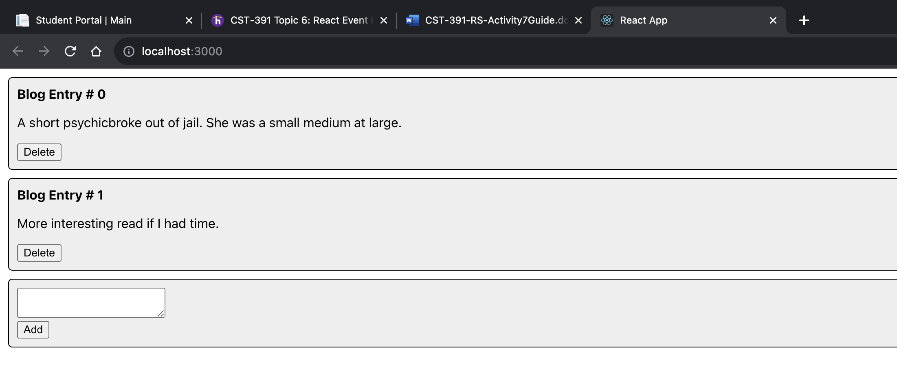
Blog app after using the delete button. The blog post is now deleted.

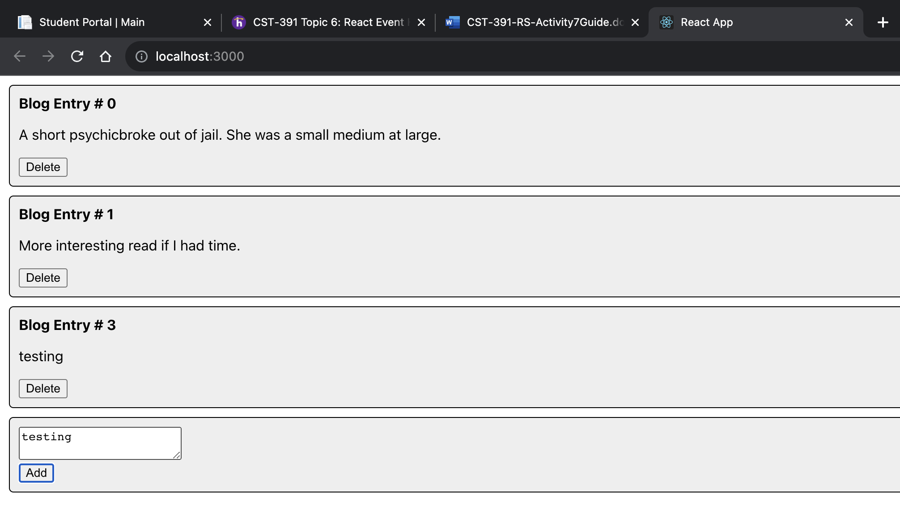
Blog app after using the add button. A new blog post appears.

## Part 5 Tracks, Lyrics and Video

### Screenshots
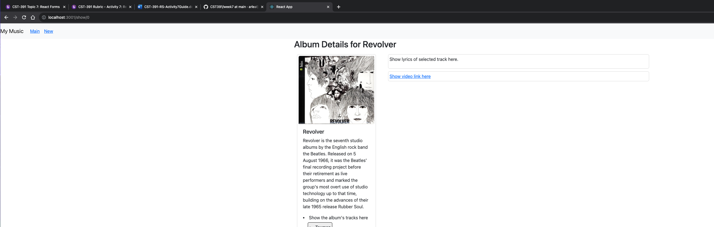
Single Album view page. This will be rendered when a user clicks an album from the homepage.

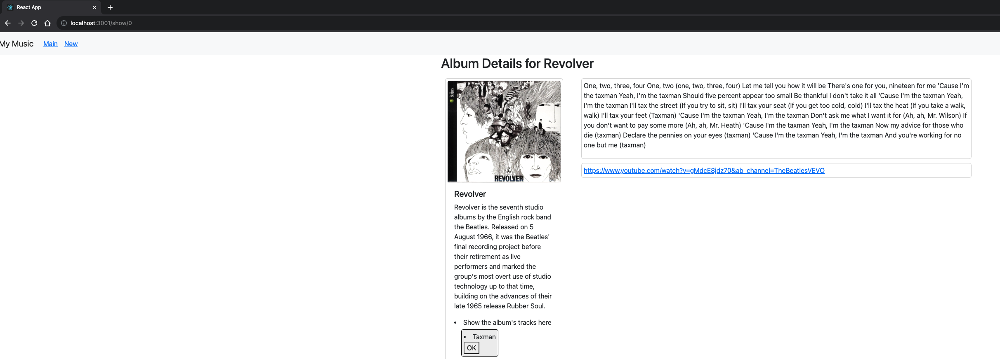
Album view page with updated lyrics and video link after clicking a track (Taxman).

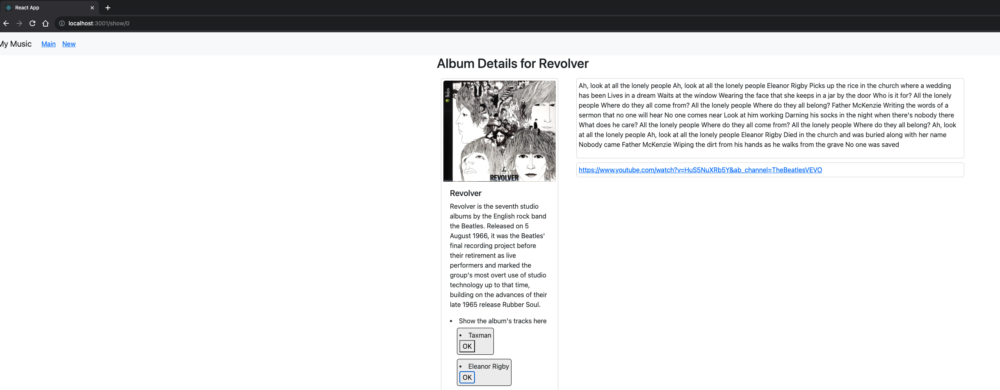
Album view page with updated lyrics and video link after clicking a track (Elanor Rigby).

### Summary
In this part of the Activity, I have updated the Single Album View to show the tracks. Upon clicking a track, the lyrics and video link will be displayed as shown above. I did this by creating the new components TrackLyrics, TrackTitle, TrackList, TrackVideo, and Track and updating the onClick and handlers for these components. This really put my knowledge of props and state to the test.

## Part 6: Create New Album

### Screenshots
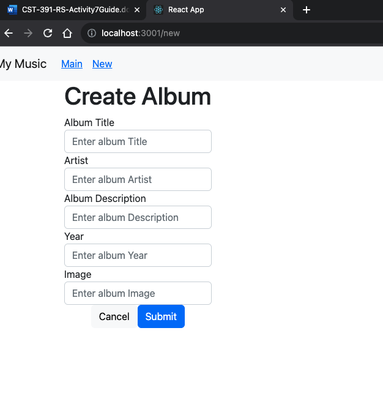
Create an Album view page. You will be directed here from the new link in the navbar.

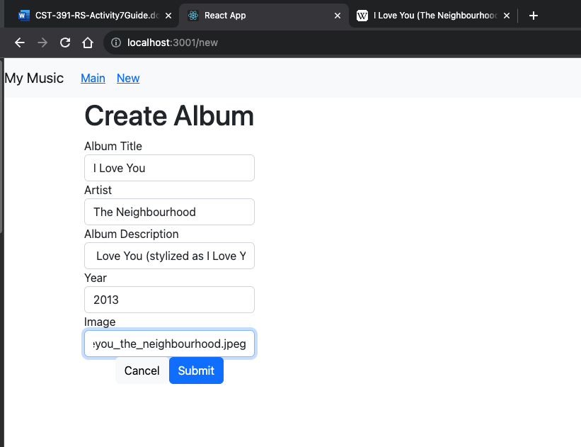
Create an Album view page with details filled in.

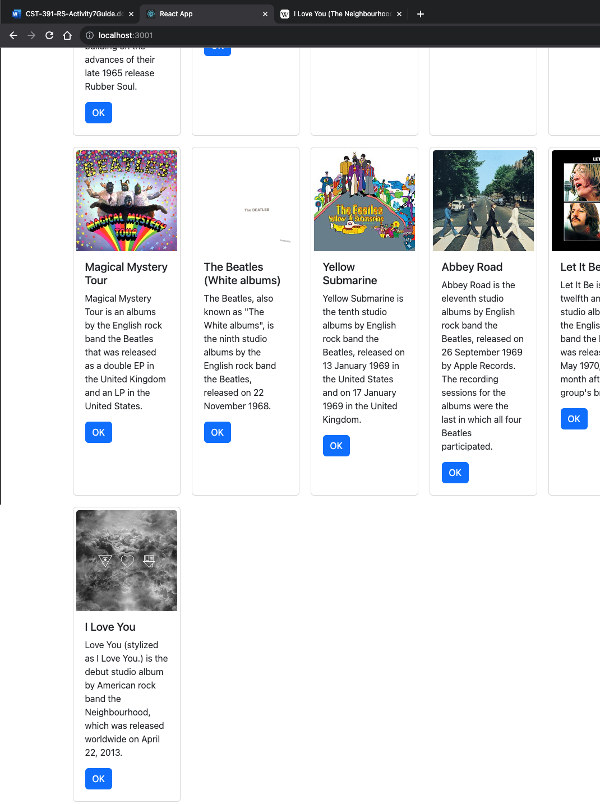
Album List and Music application home page updated to reflect new album created.

### Summary
In this part of the activity, we added the ability to create an Album. This then updates our album list and displays it on our homepage. To do this we created an AddAlbum component which made use of a Bootstrap form. Afer modifying, we added the functions handleFormSubmit and handleCancel. This allows the user to cancel or submit the new album. By using controlled components, the form was able to maintain its own state and update it based on user input.
## Part 7: Edit an Album

### Screenshots
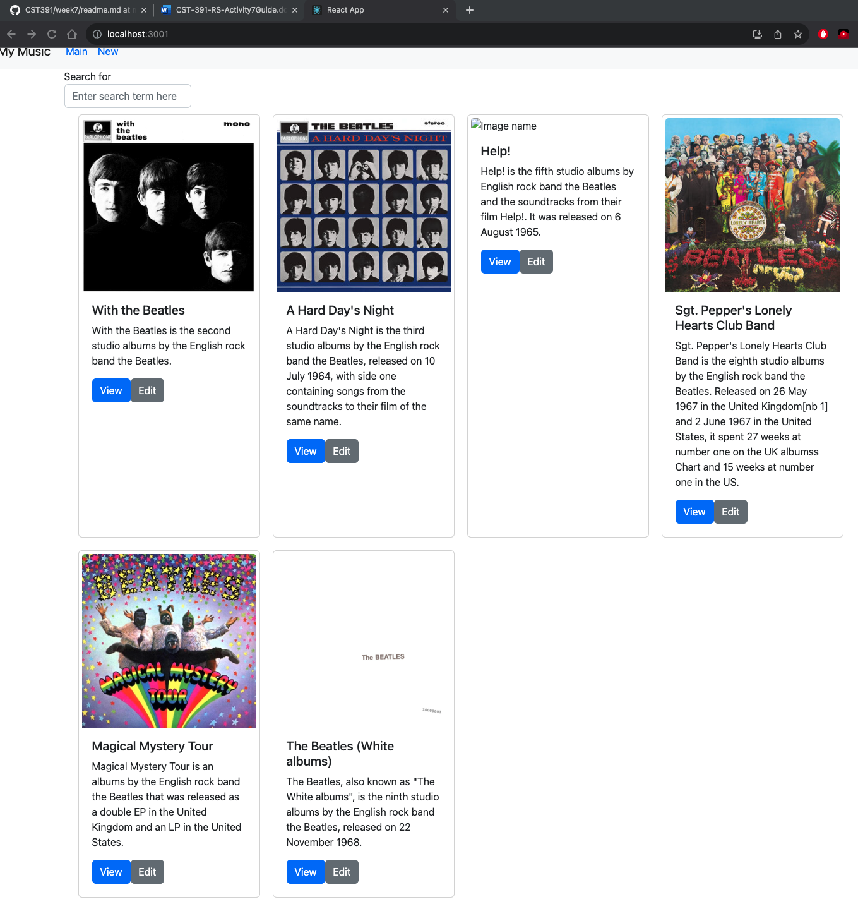
Album Homepage with current album list.

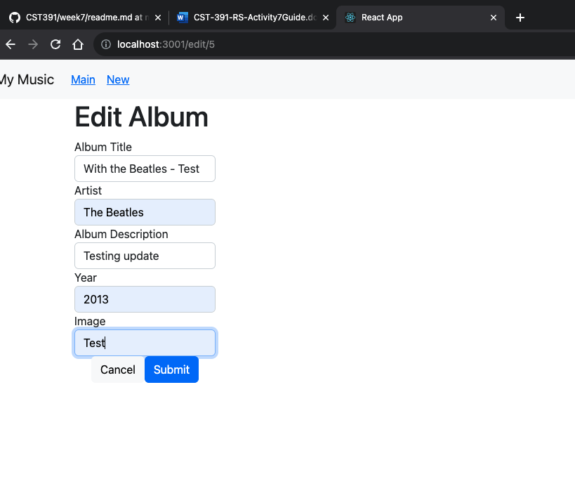
Edit Album Component.

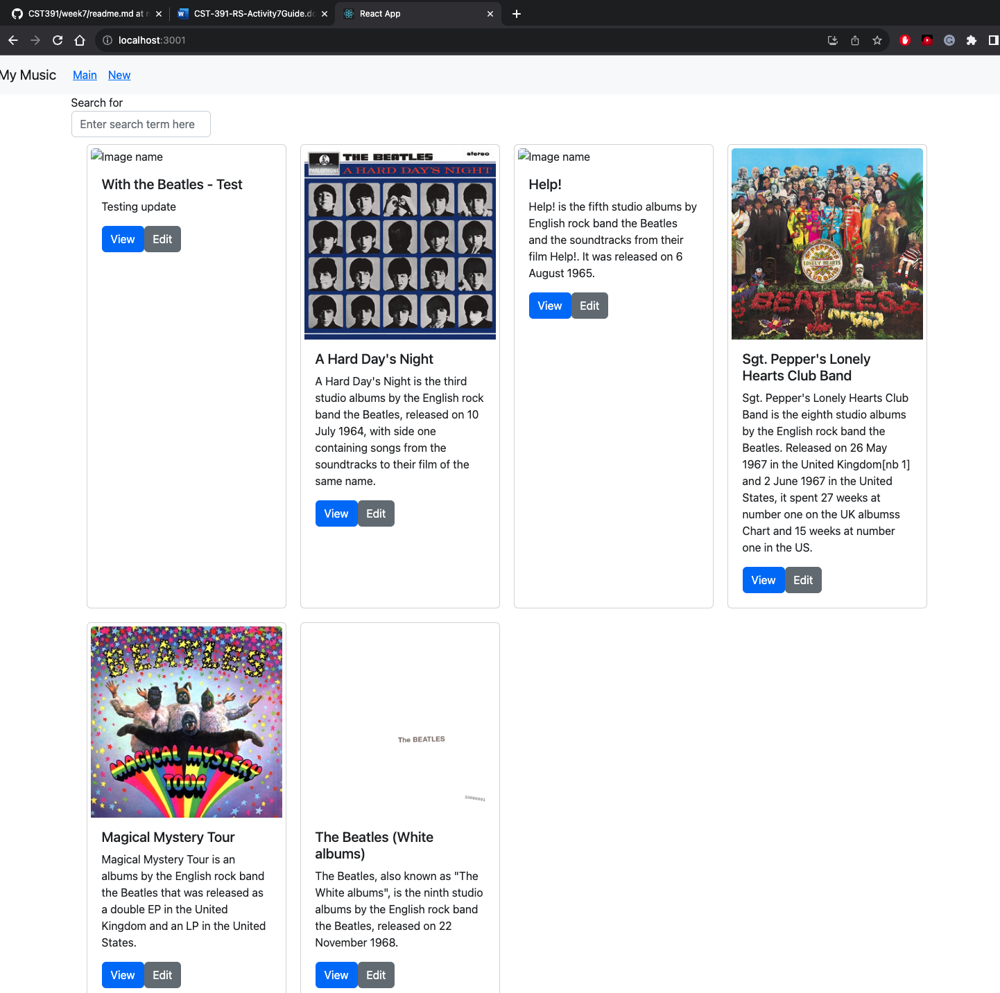
Updated Album Homepage after submitting the Edit view above. 

### Summary
In this last part of the activity, we added the edit ability to our application. Once the edit button is clicked, the id gets passed and is sent to the API as a put method. The approach used was to modify the AddAlbum to handle edits, this is to minimize maintenance efforts. We updated the component to check if the album is existing already, if it is a put method is sent if not a post method is sent to the API.

